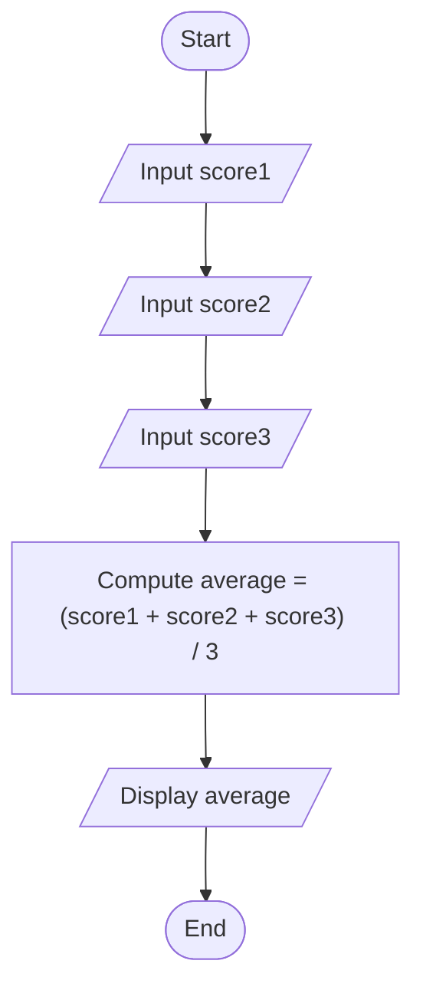

```mermaid
flowchart TB
    A(["Start"]) --> B[/"Input score1"/]
    B --> C[/"Input score2"/]
    C --> D[/"Input score3"/]
    D --> E["Compute average = (score1 + score2 + score3) / 3"]
    E --> F[/"Display average"/]
    F --> G(["End"])
```