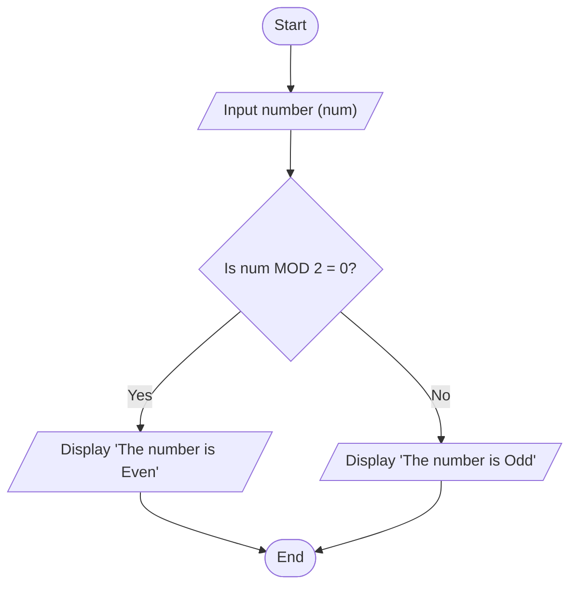

```mermaid
flowchart TB
    A(["Start"]) --> B[/"Input number (num)"/]
    B --> C{"Is num MOD 2 = 0?"}
    C -->|Yes| D[/"Display 'The number is Even'"/]
    C -->|No| E[/"Display 'The number is Odd'"/]
    D --> F(["End"])
    E --> F
```